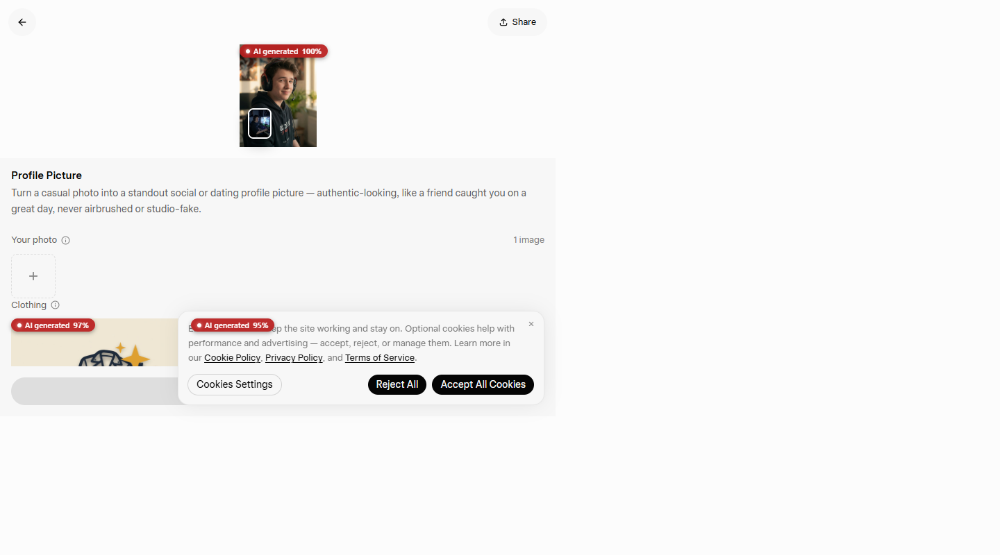
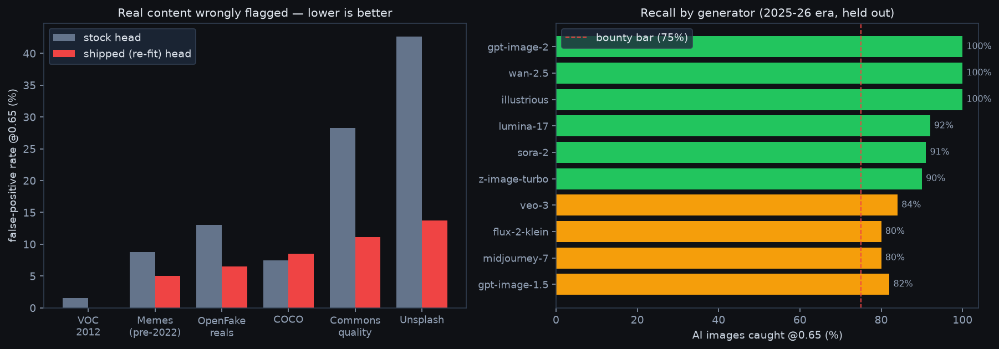

# Local AI Image Detector — Chrome Extension

A Manifest V3 Chrome extension that detects AI-generated images with **all inference
running on-device** (WebGPU, WASM fallback). No cloud, no APIs, no local server —
no image data ever leaves the browser.

Built for the [poidh "local AI challenge" bounty](https://poidh.xyz/arbitrum/bounty/323):
≥75% balanced accuracy at a fixed 0.65 confidence threshold, evaluated offline.

## In action

Live on x.com and grok.com — red pill = judged AI at ≥65% confidence, small chip =
score below threshold, blue "graphic" chip = charts/screenshots where a photo detector
doesn't meaningfully apply:

| | |
|---|---|
|  |  |



## Measured accuracy



**89.5% pooled balanced accuracy @ threshold 0.65** on a 2,500-image evaluation that was
deliberately built to be hard (details in [eval/RESULTS.md](eval/RESULTS.md)):

- Fakes: OpenFake test split — 19 generators including **sora-2, gpt-image-2,
  flux-2-klein, midjourney-7, z-image-turbo** (2025–26 era), never trained on.
- Reals: **six distributions** — OpenFake reals, COCO, Pascal VOC, Wikimedia Commons
  quality images, Unsplash, and pre-2022 memes (meme-laundered photos: text overlays,
  heavy recompression — what social feeds are actually full of). FPR is uniform
  (0–14%) across all six.
- Everything web-realistically re-encoded (≤1024px, JPEG q85) identically for both
  classes so format cues can't leak.
- Out-of-distribution check: 99.6% recall on Community Forensics' own held-out
  generators — the fine-tuned head did not narrow to one fake distribution.
- AUC 0.959 · fake recall 87.2% at the 0.65 operating point.

Per-generator recall at the fixed 0.65 threshold (shipped model, held-out images):

| Generator | Recall | Generator | Recall |
|---|---|---|---|
| illustrious | 100% | z-image-turbo | 90% |
| wan-video-2.5 | 100% | veo-3 | 84% |
| gpt-image-2 | 100% | gpt-image-1.5 | 82% |
| sora-2 | 91% | flux-2-klein | 80% |
| lumina-17 | 92% | midjourney-7 | 80% |
| recraft-v3 / seedream-v5 | 88–89% | ideogram-2 / nano-banana* | 67–71% |

False-positive rate on real photos, stock head vs shipped re-fit head:

| Real source | Stock head | Shipped |
|---|---|---|
| Pascal VOC 2012 | 1.5% | **0.0%** |
| Pre-2022 memes | 8.8% | **5.0%** |
| COCO val | 7.5% | **8.5%** |
| OpenFake reals | 13.0% | **6.5%** |
| Wikimedia Commons quality | 28.3% | **11.1%** |
| Unsplash | 42.6% | **13.7%** |

\* 6–7 eval images each — small-sample numbers.

Full methodology, ablations (graphic gate: −0.06pp on the benchmark), and every
intermediate measurement: [eval/RESULTS.md](eval/RESULTS.md). This is our own proxy
benchmark — built from sources disjoint from training and scored by
[eval/harness.py](eval/harness.py), reproducible end-to-end — not the bounty's private
benchmark.

## The model

[Community Forensics ViT-S/16 @384](https://huggingface.co/OwensLab/commfor-model-384)
(MIT-licensed weights; [Park & Owens, CVPR 2025](https://arxiv.org/abs/2411.04125),
trained on 4,803 generators) with **a re-fit classification head** trained on frozen
features to fix a measured blind spot: the stock head false-positives heavily on modern
professional photography (42.6% FPR on Unsplash). The re-fit (weighted logistic
regression, L2-regularized toward the original head, trained only on provably-real
content: pre-2022 camera-EXIF Unsplash, Wikimedia Commons quality images, and pre-2022
memes) brings Unsplash to 13.7% and memes from 45.8% to 4.4%, while still raising fake
recall over stock. A calibration offset (+1.67 logits) centers the optimal
balanced-accuracy operating point exactly at the required 0.65 threshold.

Exported to ONNX (fp32, 87MB, committed in `extension/models/detector.onnx`) and
executed by ONNX Runtime Web — WebGPU when available, single-thread WASM otherwise.

## Install (Chrome or Brave)

```bash
git clone <this repo>
cd ai-image-detector/extension
npm install          # pinned onnxruntime-web 1.27
node build.mjs       # vendors ORT runtime + wasm into lib/ort/ (no CDN at runtime)
```

Then: `chrome://extensions` → enable **Developer mode** → **Load unpacked** → select
the `extension/` folder (the folder containing `manifest.json`). Click the toolbar
icon and switch **Detection** on. See [INSTALL.md](INSTALL.md) for details and
troubleshooting.

The model ships inside the repo — after `git clone` + `npm install` the extension is
**fully offline**; it performs no downloads at any point.

## What it does

- Analyzes images **one at a time, viewport-first** — the queue always takes the image
  nearest the top of your current viewport, so scrolling re-prioritizes naturally and
  the machine is never saturated.
- **Every analyzed image gets a visible confidence score**: a red pill
  (`AI generated · 97%`) at ≥65%, a small neutral chip (`3%`) below it. Hover for
  details. (The all-scores chips can be toggled off in the popup.)
- Works on real websites: single-page apps (x.com — injected into open tabs, survives
  SPA navigation), CSS background images, `<picture>`/srcset, lazy-loaded feeds,
  open shadow DOM, iframes, `blob:`/`data:` URLs, and strict-CSP sites (tags are styled
  via CSSOM, which `style-src` cannot block). Language-independent: the pipeline reads
  pixels and DOM structure, never page text (verified live on Japanese and Arabic
  pages).
- **Knows what it doesn't know**: charts, tables, and UI screenshots are detected by a
  pixel-statistics gate (97% of rendered graphics incl. dense multi-panel charts after
  social-media recompression, 2.5% of photos) and labeled
  "graphic" with reduced confidence instead of pretending a photo detector's score is
  meaningful there.
- **Never re-analyzes**: per-element, per-URL, and SHA-256 content-hash caches (the
  hash cache persists locally and recognizes the same image on any page; toggleable,
  clearable).
- Popup shows live session stats (analyzed / flagged / avg latency / cache hits),
  engine + backend, and the calibrated threshold.

## Architecture

```
content script (per page)          background service worker       offscreen document
─────────────────────────          ─────────────────────────       ──────────────────
discover images (img/bg/shadow/    route + in-memory URL cache     fetch bytes (host-permission
iframe/blob), IntersectionObserver ensure offscreen doc            CORS-exempt), SHA-256 hash
viewport-priority queue (1 at a    session stats                   cache (storage.local),
time) → overlay score pills                                        decode → 440/384 preprocess →
                                                                   ONNX Runtime Web (WebGPU→WASM)
```

## Reproducing the model from source

The shipped `detector.onnx` is deterministically rebuilt from public inputs:

```bash
pip install torch timm onnxruntime onnx datasets pillow numpy huggingface_hub
git clone https://github.com/JeongsooP/Community-Forensics vendor/Community-Forensics
cd eval
python export_features.py                 # backbone (HF: OwensLab/commfor-model-384, MIT) + original head
python bake_head.py --head models/head_384_refit_hi.npz --offset 1.67   # -> commfor_vits_384_refit.onnx
```

`models/head_384_refit.npz` (the 385-parameter re-fit head) is committed. To re-train
it from scratch instead: `eval/build_proxy.py`, `build_trainpool.py`, `fetch_unsplash.py`,
`fetch_commons.py` rebuild the datasets from public sources, then `refit_head.py`
re-fits and reports; `harness.py` scores any model on any real/fake image tree.
[eval/RESULTS.md](eval/RESULTS.md) documents every measurement in this README.

## Compliance notes (bounty rules)

- No cloud inference, no external APIs, no localhost/backend processes — the extension
  runtime consists of a content script, a service worker, and an offscreen document.
- No downloads after install (the model is in the package; ORT is vendored at build time).
- No benchmark hashes or lookup tables: the hash cache stores only the extension's own
  past *outputs*, keyed by content hash, as a performance optimization — it contains
  nothing at install time and can be disabled in the popup.
- Confidence score displayed for every analyzed image (default on).
- MIT license: this repo, the base model weights, and ONNX Runtime.

## Credits

- Model: [Community Forensics](https://arxiv.org/abs/2411.04125) (Jeongsoo Park & Andrew
  Owens, CVPR 2025) — weights `OwensLab/commfor-model-384`, MIT.
- Runtime: [ONNX Runtime Web](https://onnxruntime.ai/) (MIT).
- Evaluation data: OpenFake (ComplexDataLab), COCO, Pascal VOC, Wikimedia Commons,
  Unsplash Lite, Community Forensics Small — see eval/ scripts for exact usage.
